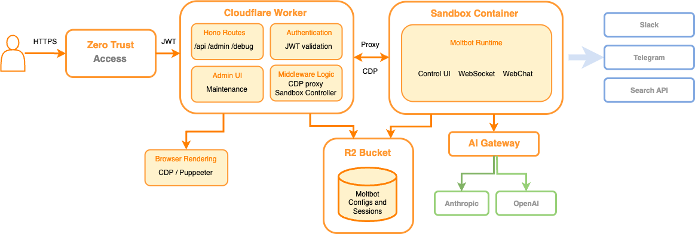

# TXT CLAW Stack Public

Cloudflare Worker + sandbox runtime for an OpenClaw-based agent gateway, with a protected admin UI, device pairing flow, persistent state, and a developer-facing HTTP/MCP surface.

Stack: TypeScript, Hono, React, Cloudflare Workers, Cloudflare Sandbox, Durable Objects, R2  
I owned: runtime packaging, admin/control surface, pairing/auth flows, persistence strategy, public API shape, and the developer docs layer around it  
Origin Lab relevance: productizing an agent runtime, building a reliable control plane, and exposing a clean API/MCP surface on top of a complex backend



## What This Repo Shows

- Worker-based gateway wrapper around an agent runtime
- Authenticated admin UI with device approval flow
- Durable Object backed directory and traces
- Optional persistent storage via R2
- Public API routes plus companion docs for HTTP and MCP usage

## Quickstart

```bash
pnpm install
pnpm test
pnpm typecheck
pnpm build
```

For local development:

```bash
pnpm start
```

## Public Docs Included

- [`docs/quickstart.md`](./docs/quickstart.md)
- [`docs/agents.md`](./docs/agents.md)
- [`docs/openapi.yaml`](./docs/openapi.yaml)
- [`docs/mcp.md`](./docs/mcp.md)
- [`docs/routing.md`](./docs/routing.md)
- [`docs/byok.md`](./docs/byok.md)

## Repo Highlights

- [`src/routes`](./src/routes): public routes, admin routes, and API entrypoints
- [`src/txtclaw`](./src/txtclaw): runtime, credentials, limits, traces, and bridge logic
- [`src/client`](./src/client): admin/control UI
- [`assets/adminui.png`](./assets/adminui.png): admin surface snapshot

## Why This Matters

This is the productization side of AI systems work: taking a powerful but messy runtime, then wrapping it in a control plane that developers and operators can actually use. The interesting part is not just running the model loop. It is auth, persistence, lifecycle, traceability, failure recovery, and a clean external surface.

## Security / Public Mirror Notes

- Private deployment state, generated build output, local env files, and launch/partnership docs were removed
- This mirror keeps the core runtime/control-plane code and a cleaned documentation surface
- Some provider env var names remain in source because they are part of the integration contract, but no live secrets or private domains are included
